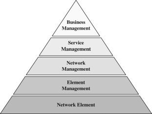

[Main Menu](../../../sessions/README.md)|[session1](../../session1/) | [Session 1 Notes](../docs/sessionNotes.md)

# Session 1 Notes

## Introductory slides

[Introduction To Network Management](../../session1/docs/SolentLecture-Intro2-CG-2019.pdf)

## FCAPS

Network management an be thought of under five core functions: Fault, Configuration, Accounting, Performance and Security 

These concepts were developed in the early 1980s in the International Standards organisation ISO and standardised in the International Telecommunications Union ITU-T M3400 standards.

* [Wikipedia definition of FCAPS](https://en.wikipedia.org/wiki/FCAPS)
* [International Telecommunications Union ITU-T M.3400](M.3400 TMN Management Functions https://www.itu.int/rec/T-REC-M.3400-200002-I/en)

|Function     |  description    |
|:------------|:-------- |
| Fault       | Recognise, isolate, correct and log faults that occur in the network. May include Alarm & Event correlation            |
| Configuration      | to gather and store configurations from network devices o simplify the configuration of the device to configure topology           |
| Accounting      | Tracking network utilisation information, such that individual users, departments, or business units can be appropriately billed          |
| Performance        | ensuring that network performance remains at acceptable levels plan future network expansion           |
| Security        | controlling access to assets in the network using authentication and encryption. detect, record and remedy security breaches           |

## Telecommunication Management Network

see https://www.sciencedirect.com/topics/computer-science/telecommunication-management-network

| Layer                   | Description   |
|--------------------|--- |
|Business Management | Manages business accounts, longer term strategy|
|Service Management | Addresses user-experienced aspects such as quality of service and Service Level Agreements|
|Network Management | Manages network topology and aggregates fault and performance data across the network.|
|Element Management |Managing multiple elements - usually from the same vendor. Supports software updates and local configuration. May support upward facing protocols such as OSS/J/ TMForum APIs etc  |
| Network Element | NE may support management protocols such as SNMP, SYSLOG or gRPC NE may also have a local GUI or CLI for configuration|

## Standards Models and Protocols

A network protocol is  set of standardised rules and guidelines that enable devices to communicate with each other across a network by defining how data is formatted, transmitted, and received. Network Management Systems use various protocols to communicate with equipment and communicate between themselves.

Usually a Network Management Protocol will define an 
* Information Model which tells us what the management information means and a 
* Transport Protocol which defines how information about changes to the model are transmitted between management systems

Often in IoT systems, the shared model is called a 'Digital Twin' of the real world object it represents.

| Layer      | Protocol      | Transport                  | Model Definition              | Notes |
|:-----------|:--------------|:---------------------------|:------------------------------|:------|
| Element    | TL1           | ASCII                      | Proprietrary / Telcordia      |       |
|            | SYSLOG        | ASCII                      | Varies by vendor              |       |
|            | CLI           | ASCII                      | Varies by vendor              |       |
|            | SNMP          | Binar                      | MIB Abstract Syntax Notation One (ASN.1)   |       |
|            | gRPC          | Protobuf (Binary)          | Protobuf definition           |       |
|            | ReST          | HTTP                       | Json proprietary              |       |
|            | Microsoft WS-MAN | Http                    | Microsoft version of CIM      |       |
|            | Streaming Telemetry | Protobuf             | Protobuf definition           |       |
|            |               |                            |                               |       |
| Network    | DMTF WeBM     |  HTTP like                 |  DMTF CIM Model               |       |
|            | OSI CMIP/CMIS  | Abstract Syntax Notation One (ASN.1) | ITU.802            |       |
|            | TINA-C        | CORBA                           |  ITU.802                 |       |
|            | TM Forum APIs   | ReST and Kafka           |                               |       |
|            |               |                            |                               |       |
