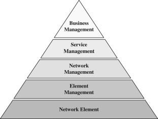

[Main Menu](../../../sessions/README.md)|[session1](../../session1/) | [Session 1 Notes](../docs/sessionNotes.md)

# Session 1 Notes

## FCAPS

Network management an be thought of under five core functions: Fault, Configuration, Accounting, Performance and Security 

These concepts were developed in the early 1980s in the International Standards organisation ISO and standardised in the International Telecommunications Union ITU-T M3400 standards.

* [Wikipedia definition of FCAPS](https://en.wikipedia.org/wiki/FCAPS)
* [International Telecommunications Union ITU-T M.3400](M.3400 TMN Management Functions https://www.itu.int/rec/T-REC-M.3400-200002-I/en)

## Telecommunication Management Network

see https://www.sciencedirect.com/topics/computer-science/telecommunication-management-network

| Layer                   | Description   |
|--------------------|--- |
|Business Management | Manages business accounts, longer term strategy|
|Service Management | Addresses user-experienced aspects such as quality of service |
|Network Management | manages network topology, establishes routing and signaling paths, and aggregates fault and performance data across the network.|
|Element Management |Managing multiple elements - usually from the same vendor. Supports software updates and local configuration. May support upward facing protocols such as OSS/J/ TMForum APIs etc  |
| Network Element | NE may support management protocols such as SNMP, SYSLOG or gRPC NE may also have a local GUI or CLI for configuration|
