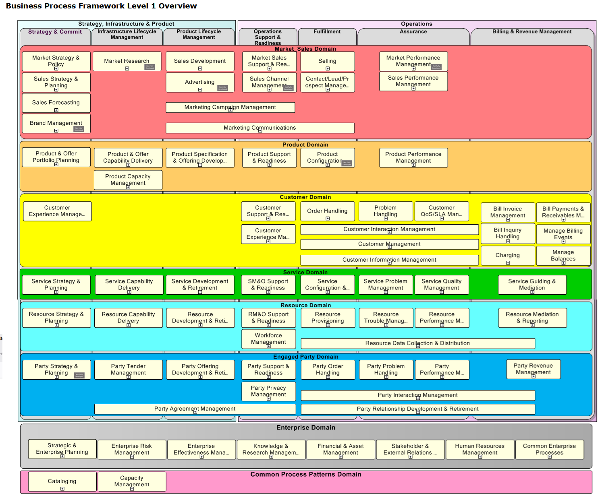
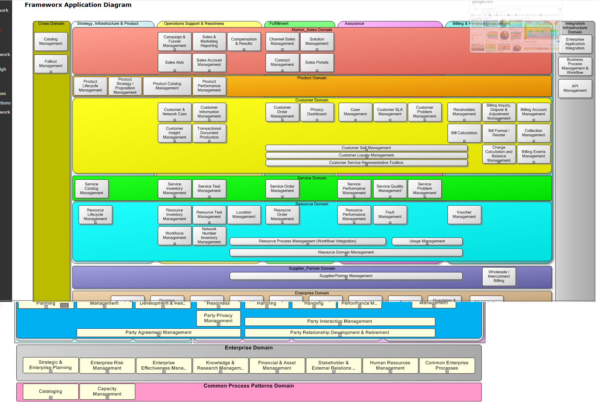
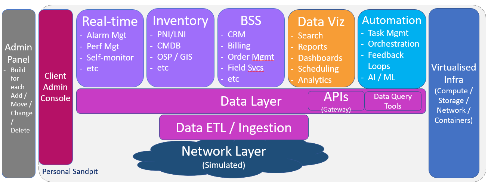

[Main Menu](../../../sessions/README.md) |[session12](../../session12/) | [Session 2 Notes](../docs/sessionNotes.md)

# Session 2 Notes

## GB921 Business Process Framework (eTOM)

You can download all information related to this standard if you set up a university account using your university email.

[GB921 Business Process Framework (eTOM)](https://www.tmforum.org/resources/suite/gb921-business-process-framework-etom-suite-v25-0/)

You can also browse an [online version of the eTOM](http://www.ilsa.kz/etom/main/diagramac379ad6e0054204b29009c3d82ff997.htm)

## Telecoms Application Framework

The Application Framework (originally known as TAM) is the ongoing TM Forum initiative to deliver an application architecture or framework for use by service providers and others within the Information Communications, and Entertainment industries.

The TAM maps applications within an Operations Support System

You can download all information related to this standard if you set up a university account using your university email.

https://www.tmforum.org/resources/suite-standard/gb929-application-framework-tam-suite-v25-0/   GB929 Application Framework (TAM) Suite v25.0

[TAM Online Version](http://www.ilsa.kz/etom/main/diagram212bd3bc1d9811db9063000802da1ce2.htm)

## Passionate about OSS

Ryan Jeffery, an Australian, has created a web site which discusses Operational Support Systems called [Passionate About OSS](https://passionateaboutoss.com/)

He has been working on a simpler model to help explain OSS systems called the [OSS Sandpit](https://passionateaboutoss.com/building-a-personal-oss-sandpit/)

This model is much simpler and more realistic than the TAM, when trying to construct a system for the average network.

| category   | definition | Notes |
|:-----------|:-----------|:------|
| Real Time  |Alarm Mgt   | Alarm and Event Management Systems e.g. OpenNMS / HP TeMIP   |
|            |Perf Mgt   |  Performance Management Systems e.g. OpenNMS / Prometheus     |
|            |Self Monitor  | e.g. JMX    |
|            |               |                   |
| Inventory  |CMDB   |                                                                                |
|            |PNI / LNI              | PNI refers to Physical Network Inventory (PNI) and Logical Network Inventory (LNI)  |
|            |OSP / GIS | OSP (Outside Plant) referring to the physical network assets and GIS (Geographic Information System) |
|            |               |                   |
| BSS        |CRM   | Customer Relationship Management e.g. Salesforce.com |
|            |Billing   |  e.g. SAP           |
|            |Order Management  |                                                       |
|            |Field Services   |  May be controlled through a trouble Ticket System     |
|            |               |                   |
|Data Visualisation |Reports   |     |
|            |Search | Ability to search the data stores by time/ device/service etc. Example: Elastic Search in ELK stack    |
|            |Dashboards  |  Ability to create per user function or per customer collections of visual widgets e.g. Grafana / Kibana  |
|            |Schedulling | Ability ot schedule generation of reports and posting results to users |
|            |Analytics   | Ability to apply complex mathematical functions on data. e.g. Hadoop   |
|            |               |                   |
| Automation |Task Management   |  Ability to automate scheduling of tasks in a process including human and automated elements |
|            |Orchestration   | Automated deployment of resources e.g. Kubernetes / Ansible  |
|            |Feedback Loops  | Ability to use policies to control how data changes the infrastructure e.g. scale up / down based on load. |
|            | AI / ML |Artificial Intelligence / Machine Learning. e.g learning what is 'normal' and alerting on abnormal behaviour |
|            |               |                   |

