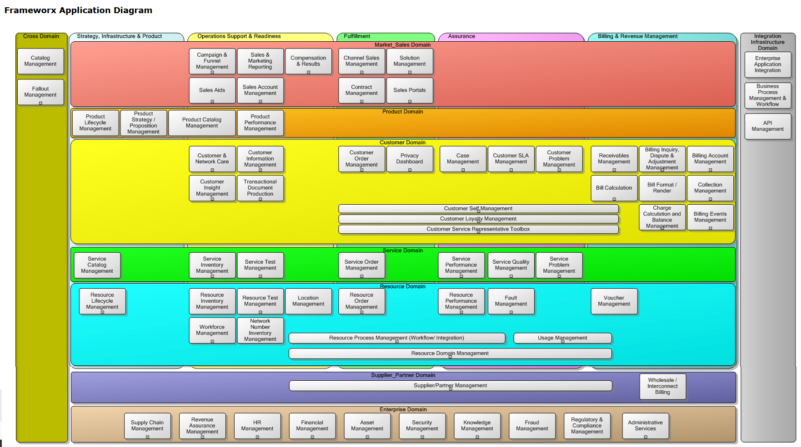

[Main Menu](../../../sessions/README.md) |[session12](../../session12/) | [Session 2 Notes](../docs/sessionNotes.md)

# Session 2 Notes

## GB921 Business Process Framework (eTOM)

You can download all information related to this standard if you set up a university account using your university email.

[GB921 Business Process Framework (eTOM)](https://www.tmforum.org/resources/suite/gb921-business-process-framework-etom-suite-v25-0/)

You can also browse an [online version of the eTOM](online version http://www.ilsa.kz/etom/main/diagramac379ad6e0054204b29009c3d82ff997.htm)

## Telecoms Application Framework

The Application Framework (originally known as TAM) is the ongoing TM Forum initiative to deliver an application architecture or framework for use by service providers and others within the Information Communications, and Entertainment industries.

The TAM maps applications within an Operations Support System

You can download all information related to this standard if you set up a university account using your university email.

https://www.tmforum.org/resources/suite-standard/gb929-application-framework-tam-suite-v25-0/   GB929 Application Framework (TAM) Suite v25.0

[TAM Online Version](http://www.ilsa.kz/etom/main/diagram212bd3bc1d9811db9063000802da1ce2.htm)

## Passionate about OSS

